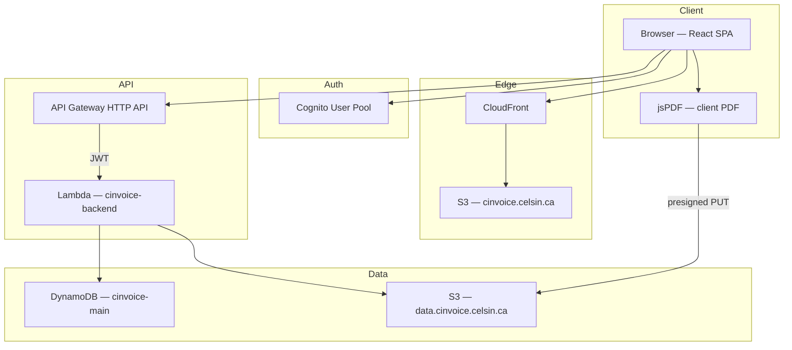

# CInvoice — Billing & Invoicing Workspace

[](https://github.com/SinanCirak/CInvoice/actions/workflows/deploy-site.yml)

**Tech Stack:** AWS (Lambda, API Gateway, DynamoDB, S3, CloudFront, Cognito), Terraform, React, TypeScript, GitHub Actions

**Live:** [https://cinvoice.celsin.ca](https://cinvoice.celsin.ca)

A full-stack invoicing workspace for small businesses — client management, catalog, PDF generation, payment tracking, and cloud persistence. Built with React, TypeScript, a Python serverless backend, and Infrastructure as Code.

## 📈 Impact

Designed to replace spreadsheets and ad-hoc billing workflows with a secure, scalable, cloud-native system. CInvoice centralizes clients, line items, invoices, and payment status in one place, with branded PDF export and per-user data isolation on AWS.

## 💡 Why This Project?

CInvoice focuses on real small-business billing needs: GST/HST-aware line items, client records, invoice lifecycle (draft → open → partial → paid), payment recording, and company payment details on PDFs (EFT, Interac e-Transfer).

This project demonstrates:

- **Full-stack development** with React 19, TypeScript, and Vite
- **Serverless architecture** using a single Lambda + API Gateway HTTP API + DynamoDB
- **Single-table DynamoDB design** with GSIs for invoice status and client-scoped queries
- **Infrastructure as Code** with Terraform (applied manually when infra or backend changes)
- **Continuous delivery** for the static frontend via GitHub Actions (build → S3 → CloudFront invalidation)
- **Production-ready features** including Cognito auth, workspace sync, S3 PDF storage, and mobile-responsive UI
- **Best practices** in security, tenant isolation, and maintainability

## 🚀 Features

### Dashboard
- Revenue KPIs and CRM-style summary cards
- Period filters (week, month, quarter, year)
- Finance charts and recent invoice list
- Quick navigation to create invoice and full invoice list

### Client Management
- Create, edit, and search clients
- Client ID numbering (`CL-001`, …), GST/HST, location
- Delete confirmation by typing Client ID (same pattern as invoice delete)
- Total invoiced per client

### Items & Services (Catalog)
- Catalog of billable items with type, unit, default rate, and tax rate
- Inline edit and delete
- Persists to DynamoDB via workspace sync

### Create Invoice
- Client picker (existing clients or ad-hoc name)
- Dynamic line items from catalog or manual entry
- Invoice meta: dates, terms, notes
- Live subtotal, tax, and total calculation
- **Client-side PDF export** (jsPDF) with company branding and payment block
- PDF upload to S3 via presigned URL

### Invoices
- Search, sort, and filter invoice list
- Quick edit (inline modal)
- Record payments (channel, amount); persists to DynamoDB
- Payment panel hidden when invoice is fully paid
- Open stored PDF via presigned download URL
- Delete confirmation by typing invoice number

### Settings (Company)
- Company profile, address, tax number, logo
- Payment settings (EFT, Interac e-Transfer) — rendered on invoice PDF footer
- Stripe settings (backend; admin)
- **Change password** via Cognito (Settings → Security)

### Mobile UI
- Responsive layout at ≤768px (desktop layout unchanged at ≥769px)
- Hamburger drawer navigation, compact list cards, touch-friendly controls
- Horizontal scroll for create-invoice line-item table

### Authentication & Security
- **AWS Cognito** email/password sign-in (SRP + refresh tokens)
- JWT authorizer on API Gateway for protected routes
- All workspace data scoped by Cognito `sub` in DynamoDB
- Destructive actions require typing entity ID to confirm

## 🏗️ Architecture

### Frontend
- **Framework**: React 19 + TypeScript
- **Build Tool**: Vite 8
- **Routing**: React Router 7
- **State**: React component state in `App.tsx` (workspace snapshot)
- **UI**: Custom CSS (`style.css`); mobile drawer + card layouts
- **PDF**: jsPDF + html2canvas (client-side generation)
- **Authentication**: AWS Amplify / Cognito (`src/auth/cognito.ts`)

### Backend (Serverless)
- **Compute**: AWS Lambda — Python 3.12 (`cinvoice-backend`)
  - `backend.py` — HTTP router, Stripe webhook, admin helpers
  - `entities.py` — DynamoDB entity layer, workspace load/save, migrations
- **API**: AWS API Gateway HTTP API (`cinvoice-api`) with Cognito JWT authorizer
- **Database**: AWS DynamoDB single-table (`cinvoice-main`, GSI1 + GSI2)
- **File Storage**: AWS S3 — private invoice PDF bucket (`data.cinvoice.celsin.ca`)
- **Payments**: Stripe webhooks and settings (optional; env via Terraform)

### Infrastructure
- **IaC**: Terraform ≥ 1.10 (infrastructure + Lambda zip packaging; applied manually — see **Infrastructure strategy** below)
- **CI/CD**: GitHub Actions deploys the **Vite frontend** to S3 and invalidates CloudFront on pushes to `main` (Terraform and Lambda are **not** part of this workflow)
- **Region**: `ca-central-1` (primary), `us-east-1` (CloudFront ACM certificates)
- **Domain**: `cinvoice.celsin.ca` via Route 53 + CloudFront + ACM

### High-level diagram



### Request flow

1. User signs in via Cognito; SPA sends `Authorization: Bearer <ID token>` to the API.
2. On load, `GET /workspace` returns the full workspace snapshot from DynamoDB.
3. Edits (catalog, clients, invoices, payments) update React state and persist via `PUT /workspace`.
4. PDFs are generated in the browser, uploaded with `POST /invoices/presign`, and linked on the invoice record.

## ⚙️ Design Decisions

- **Monolithic Lambda**: One Python function routes all API paths — simpler deploy and shared entity layer vs. many Node handlers (as in CTrackr).
- **Single-table DynamoDB**: All entities under `USER#{sub}` with sort keys (`PROFILE`, `DRAFT`, `INVOICE#…`, `CLIENT#…`, catalog items) and GSIs for status/client queries — fewer tables, consistent access patterns.
- **Full workspace sync**: `PUT /workspace` replaces the entire tenant snapshot — straightforward SPA state model; targeted endpoints for create/delete/presign.
- **Client-side PDF**: Invoices render in the browser (no server PDF engine); bytes go to S3 via presigned URLs — keeps Lambda small and avoids binary through API Gateway.
- **GitHub Actions for frontend only**: Every merge to `main` runs the same `npm run build` and syncs to S3 + CloudFront — visible pipeline badge, no accidental infra drift from CI.

## 🔍 Observability & Reliability

- **CloudWatch**: Lambda logs and metrics for API debugging in production.
- **Stateless compute**: Horizontally scalable Lambda behind HTTP API; no session affinity on the server.
- **Structured errors**: API returns JSON error bodies; frontend surfaces messages without silent logout on transient failures.
- **S3 versioning**: Enabled on site and invoice buckets for recovery.

## 🔄 CI/CD Pipeline

This project uses GitHub Actions to automate frontend build and deployment.

### Workflow Overview
- **Workflow**: [`.github/workflows/deploy-site.yml`](.github/workflows/deploy-site.yml)
- **Trigger**: Push to `main` (paths: `src/**`, `index.html`, `vite.config.ts`, `package.json`, workflow file) or `workflow_dispatch`
- **Build Step**:
  - Node.js 22, `npm ci`, `npm run build`
  - Bakes in `VITE_*` secrets (API URL, Cognito IDs)
- **Deploy Step**:
  - `aws s3 sync dist/` → site bucket (`--delete`)
- **CDN Invalidation**:
  - CloudFront invalidation `/*` when `CLOUDFRONT_DISTRIBUTION_ID` is set

### Deployment flow

**GitHub** → **GitHub Actions** → **S3** → **CloudFront** → **End Users**

### GitHub Actions secrets

| Secret | Required | Description |
|--------|----------|-------------|
| `AWS_ACCESS_KEY_ID` | Yes | IAM user for deploy |
| `AWS_SECRET_ACCESS_KEY` | Yes | IAM secret |
| `S3_SITE_BUCKET` | Yes | e.g. `cinvoice.celsin.ca` |
| `VITE_COGNITO_USER_POOL_ID` | Yes | Cognito pool ID |
| `VITE_COGNITO_USER_POOL_CLIENT_ID` | Yes | SPA app client ID |
| `VITE_API_BASE_URL` | Yes | API Gateway invoke URL |
| `CLOUDFRONT_DISTRIBUTION_ID` | No | Skip invalidation if empty |
| `VITE_AWS_REGION` | No | Default `ca-central-1` |
| `VITE_AUTH_*` | No | Cookie / token storage overrides |

### Infrastructure strategy

Infrastructure is managed with Terraform and applied **manually** when backend or AWS resources change. The GitHub workflow deploys **only** the static SPA — it does **not** run `terraform apply` or publish Lambda code.

To update Lambda after editing `terraform/lambda/`:

```bash
cd terraform/lambda
zip -j ../backend.zip backend.py entities.py
aws lambda update-function-code --function-name cinvoice-backend --zip-file fileb://../backend.zip --region ca-central-1
```

Or run `terraform apply` in `terraform/` to rebuild the zip from source.

## 📁 Project Structure

```
CInvoice/
├── .github/workflows/
│   └── deploy-site.yml          # CI: build SPA → S3 → CloudFront
├── src/                          # React frontend
│   ├── App.tsx                  # UI, routing, PDF, workspace state, pages
│   ├── api.ts                   # Authenticated HTTP client (workspace, delete, presign)
│   ├── auth/
│   │   └── cognito.ts           # Sign-in, tokens, password change
│   ├── LoginPage.tsx
│   ├── style.css                # Desktop + mobile (≤768px) styles
│   ├── main.tsx
│   └── vite-env.d.ts
├── terraform/                    # Infrastructure as Code
│   ├── main.tf                  # Full AWS stack (S3, CloudFront, Cognito, DDB, Lambda, API GW)
│   ├── bootstrap/               # Optional remote Terraform state bucket
│   ├── lambda/
│   │   ├── backend.py           # HTTP router, Stripe, admin routes
│   │   └── entities.py          # DynamoDB entity layer, workspace sync
│   └── README.md                # Terraform-specific docs
├── scripts/
│   └── deploy-site.ps1          # Local deploy: Terraform outputs → build → S3
├── index.html
├── package.json
└── vite.config.ts
```

## 🛠️ Setup & Installation

### Prerequisites

- **Node.js**: 22+ (frontend + GitHub Actions)
- **AWS CLI**: Configured with appropriate credentials
- **Terraform**: >= 1.10
- **Python**: 3.12 (Lambda runtime; for local backend reading only)
- **AWS Account**: With permissions for deploy and/or full stack

### Installation Steps

1. **Clone the repository:**
```bash
git clone https://github.com/SinanCirak/CInvoice.git
cd CInvoice
```

2. **Install frontend dependencies:**
```bash
npm ci
```

3. **Deploy infrastructure** (first time or when infra changes):
```bash
cd terraform
terraform init
terraform apply
# Prompts for: stripe_secret_key, stripe_webhook_secret, jwt_secret (sensitive)
```

4. **Configure frontend environment:**

Create `.env.local` in the project root (values from `terraform output`):

```env
VITE_API_BASE_URL=https://xxxxxxxx.execute-api.ca-central-1.amazonaws.com
VITE_COGNITO_USER_POOL_ID=ca-central-1_XXXXXXXX
VITE_COGNITO_USER_POOL_CLIENT_ID=xxxxxxxxxxxxxxxxxxxxxxxxxx
VITE_AWS_REGION=ca-central-1
```

5. **Run locally:**
```bash
npm run dev
```

6. **Deploy frontend** — push to `main` (GitHub Actions) or manually:
```powershell
.\scripts\deploy-site.ps1
```

## 🚀 Development

### Start Development Server

```bash
npm run dev
```

The application will be available at `http://localhost:5173` (API CORS allows localhost).

## 📡 API Endpoints

Protected routes require `Authorization: Bearer <Cognito ID token>` unless noted.

### Workspace
- `GET /workspace` — Load full workspace snapshot (profile, catalog, clients, invoices, draft)
- `PUT /workspace` — Persist full workspace snapshot
- `GET /bootstrap` — Legacy/bootstrap load (JWT)
- `PUT /sync` — Legacy sync alias (JWT)

### Invoices
- `POST /invoices` — Create invoice with line items
- `GET /invoices/open` — List open/partial invoices (GSI1)
- `POST /invoices/presign` — S3 presigned URL for PDF upload
- `POST /invoices/download-url` — Presigned URL to open stored PDF
- `POST /invoices/delete` — Delete invoice (body: invoice id confirmation)

### Clients
- `POST /clients/delete` — Delete client (body: client id confirmation)

### Settings & admin
- `GET /settings/stripe` — Read Stripe settings (masked secrets)
- `PUT /settings/stripe` — Update Stripe settings
- `POST /stripe/webhook` — Stripe webhook (unsigned)
- `POST /auth/login` — Custom login helper (public)
- `POST /admin/set-password` — Admin password reset (`x-admin-secret` / JWT secret)

## 🗄️ Database Schema

### DynamoDB Table (`cinvoice-main`)

Single-table design — partition key scopes all data to one Cognito user.

| Key | Pattern | Purpose |
|-----|---------|---------|
| `pk` | `USER#{cognito_sub}` | Tenant isolation |
| `sk` | `PROFILE` | Company / user profile |
| `sk` | `DRAFT` | Create-invoice draft lines |
| `sk` | `CLIENT#{id}` | Client records |
| `sk` | `CATALOG#{id}` | Catalog items |
| `sk` | `INVOICE#{id}` | Invoices with lines, payments, PDF key |
| `GSI1PK` / `GSI1SK` | `USER#{sub}` / `STATUS#{OPEN\|PAID\|…}` | Invoice status queries |
| `GSI2PK` / `GSI2SK` | `USER#{sub}#CLIENT#{id}` / `INVOICE#{id}` | Invoices by client |

**Billing mode:** PAY_PER_REQUEST

Workspace JSON shape (API): `profile`, `catalog`, `clients`, `invoices`, `draftLines`, `meta`, `clientId`, `lastPdf`, etc.

## 📦 S3 Bucket Structure

### Site Bucket (`cinvoice.celsin.ca`)
- Vite build output (`dist/`) — HTML, CSS, JS
- Served via CloudFront with Origin Access Control (OAC)
- Public access blocked; CloudFront only
- Versioning and SSE enabled

### Invoice Bucket (`data.cinvoice.celsin.ca`)
- Private PDF storage and workspace assets (e.g. logo)
- Prefixes: `invoices/{userSub}/…`, `workspace/{userSub}/…`
- CORS configured for browser presigned uploads
- Versioning and SSE enabled
- Access via Lambda-generated presigned URLs only

## ☁️ AWS Services & Resources

### Authentication & User Management
- **AWS Cognito**
  - **User Pool** (`cinvoice-users`):
    - Email-based sign-in, auto-verified email
    - Password policy (8+ chars, upper, lower, number, symbol)
  - **App Client** (`cinvoice-web-client`):
    - SRP, password, and refresh token flows
    - No client secret (public SPA client)
    - Token validity: access/id 1 hour, refresh 30 days

### Compute & API
- **AWS Lambda** (1 function):
  - `cinvoice-backend` — Python 3.12, handler `backend.handler`, 30s timeout
  - Packages `backend.py` + `entities.py` via Terraform `archive_file`
- **AWS API Gateway** (HTTP API — `cinvoice-api`):
  - **JWT authorizer** — Cognito issuer + audience
  - **Public routes**: `POST /auth/login`, `POST /stripe/webhook`, `POST /admin/set-password`
  - **Protected routes**: workspace, invoices, clients, settings, presign, download-url
  - CORS: production domain + `http://localhost:5173`
  - Stage: `prod` (auto-deploy)

### Database
- **AWS DynamoDB** (1 table):
  - `cinvoice-main` — single-table entity store
  - GSIs: `GSI1` (invoice status), `GSI2` (client → invoices)
  - Pay-per-request billing

### Storage
- **AWS S3** (2 buckets):
  - `cinvoice.celsin.ca` — static SPA (CloudFront origin)
  - `data.cinvoice.celsin.ca` — invoice PDFs and workspace files
  - Both: versioning, encryption, public access blocked

### Content Delivery & DNS
- **AWS CloudFront**:
  - Distribution for site bucket
  - Origin Access Control (OAC)
  - Custom alias: `cinvoice.celsin.ca`
  - ACM certificate (us-east-1)
- **AWS Route 53**:
  - Hosted zone: `celsin.ca`
  - A/AAAA alias to CloudFront
  - ACM DNS validation records
- **AWS Certificate Manager (ACM)**:
  - Certificate for `cinvoice.celsin.ca`
  - Region: `us-east-1` (CloudFront requirement)

### Security & Access
- **AWS IAM**:
  - `cinvoice-lambda-role` — Lambda execution role
  - Policies: CloudWatch Logs, DynamoDB (`cinvoice-main` + indexes), S3 invoice bucket, Cognito admin auth
- **Lambda permission**: API Gateway invoke on `cinvoice-backend`

### Infrastructure as Code
- **Terraform Providers**: AWS (~> 5.50), Archive (~> 2.5)
- **Optional bootstrap**: `terraform/bootstrap/` — remote state S3 bucket

## 🔐 Security Features

- **AWS Cognito**: Authentication; ID token validated at API Gateway
- **Tenant isolation**: DynamoDB partition key = `USER#{sub}` — no cross-user reads
- **Confirm-to-delete**: Invoice and client deletion requires typing the entity ID
- **Private PDF bucket**: No public reads; short-lived presigned URLs
- **Secrets in Lambda env only**: Stripe keys, JWT admin secret never in frontend bundle
- **Origin Access Control**: S3 site bucket not directly browsable
- **HTTPS everywhere**: CloudFront + ACM on production domain

## 🛠️ Technologies Used

### Frontend
- **React 19** — UI framework
- **TypeScript 6** — Type safety
- **Vite 8** — Build tool and dev server
- **React Router 7** — Client-side routing
- **jsPDF + html2canvas** — Client-side PDF generation
- **AWS Amplify 6** — Cognito integration

### Backend
- **AWS Lambda** — Python 3.12 serverless compute
- **AWS API Gateway** — HTTP API + JWT authorizer
- **AWS DynamoDB** — Single-table NoSQL store
- **AWS S3** — Static site + invoice PDFs
- **AWS Cognito** — User authentication
- **Stripe** — Webhooks and payment settings (optional)

### Infrastructure
- **Terraform** — Infrastructure as Code
- **GitHub Actions** — Frontend CI/CD
- **AWS CloudFront** — CDN
- **AWS Route 53** — DNS
- **AWS ACM** — TLS certificates
- **AWS IAM** — Least-privilege Lambda role

## 📝 Environment Variables

### Frontend (`.env.local` / GitHub Secrets `VITE_*`)

```env
VITE_API_BASE_URL=https://xxxxxxxx.execute-api.ca-central-1.amazonaws.com
VITE_COGNITO_USER_POOL_ID=ca-central-1_XXXXXXXX
VITE_COGNITO_USER_POOL_CLIENT_ID=xxxxxxxxxxxxxxxxxxxxxxxxxx
VITE_AWS_REGION=ca-central-1
# Optional:
# VITE_AUTH_COOKIE_DAYS=90
# VITE_AUTH_COOKIE_DOMAIN=.celsin.ca
# VITE_AUTH_TOKEN_STORAGE=cookie
```

### Lambda (set by Terraform)

| Variable | Description |
|----------|-------------|
| `TABLE_NAME` | DynamoDB table (`cinvoice-main`) |
| `INVOICE_BUCKET` | PDF bucket name |
| `COGNITO_USER_POOL_ID` | Cognito pool |
| `COGNITO_APP_CLIENT_ID` | App client |
| `SETTINGS_PK` / `SETTINGS_SK` | Stripe settings keys in DDB |
| `STRIPE_SECRET_KEY` | Stripe API secret |
| `STRIPE_WEBHOOK_SECRET` | Webhook signing secret |
| `JWT_SECRET` | Admin API secret |

### Terraform (apply-time variables)

```hcl
aws_region            = "ca-central-1"
root_domain           = "celsin.ca"
app_subdomain         = "cinvoice"
stripe_secret_key     = "sk_..."      # sensitive
stripe_webhook_secret = "whsec_..."   # sensitive
jwt_secret            = "..."         # sensitive
```

## 🚀 Deployment

### Frontend: GitHub Actions (automatic)

Pushes to `main` (matching paths) trigger [deploy-site.yml](.github/workflows/deploy-site.yml):

1. `npm ci` + `npm run build`
2. `aws s3 sync dist/` → `S3_SITE_BUCKET`
3. CloudFront invalidation (if configured)

### Frontend: manual (PowerShell)

```powershell
.\scripts\deploy-site.ps1
```

Reads `terraform output`, sets `VITE_*`, builds, syncs S3, invalidates CloudFront.

### Infrastructure & Lambda (Terraform / manual)

```bash
cd terraform
terraform init
terraform apply
```

For code-only Lambda updates without full apply, zip and `aws lambda update-function-code` (see **Infrastructure strategy** above).

## 📊 Terraform Outputs

After `terraform apply`:

| Output | Description |
|--------|-------------|
| `app_domain` | Frontend FQDN (`cinvoice.celsin.ca`) |
| `site_bucket_name` | Static site S3 bucket |
| `invoice_bucket_name` | PDF S3 bucket |
| `cloudfront_distribution_domain` | CloudFront domain name |
| `cloudfront_distribution_id` | For cache invalidation |
| `cognito_user_pool_id` | Cognito User Pool ID |
| `cognito_app_client_id` | Cognito app client ID |
| `api_base_url` | HTTP API invoke URL |
| `dynamodb_table_name` | `cinvoice-main` |

## 📄 License

Private project — all rights reserved unless otherwise specified.

## 👤 Author

Sinan Cirak

## 🙏 Acknowledgments

- AWS for serverless infrastructure
- React and Vite teams
- Terraform for Infrastructure as Code
